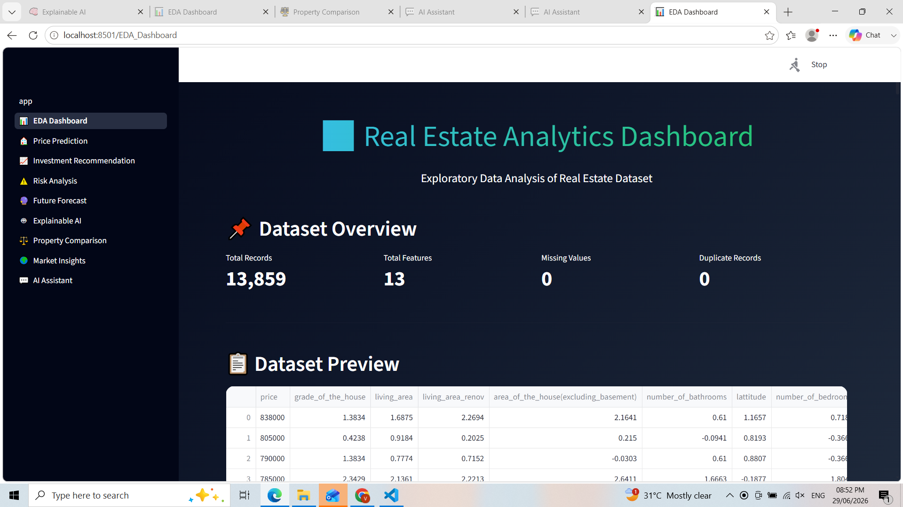
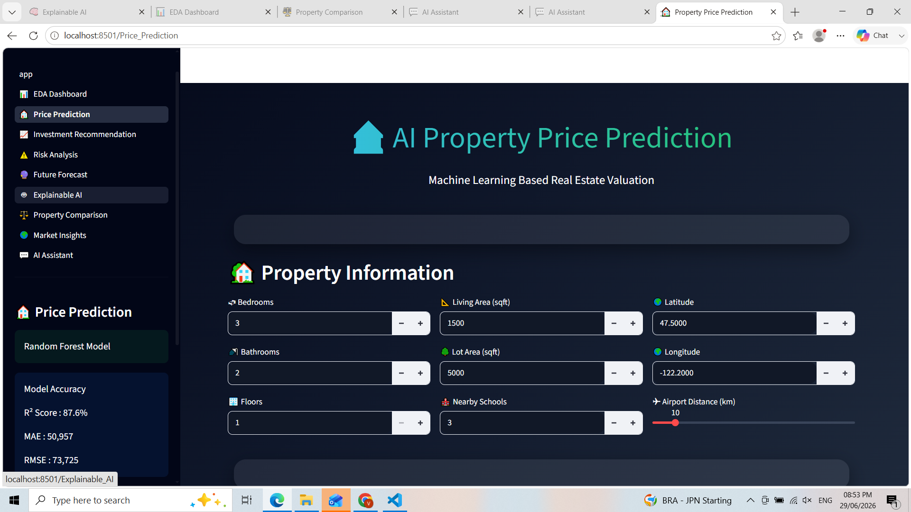
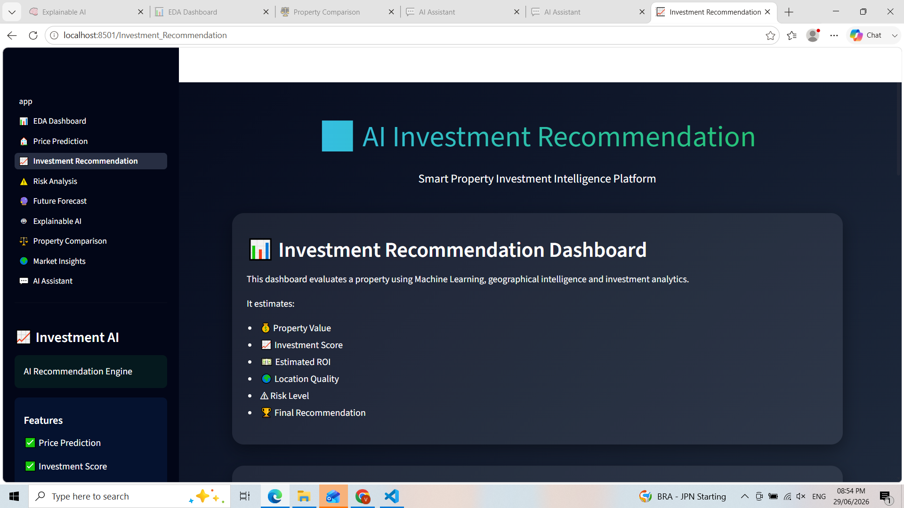
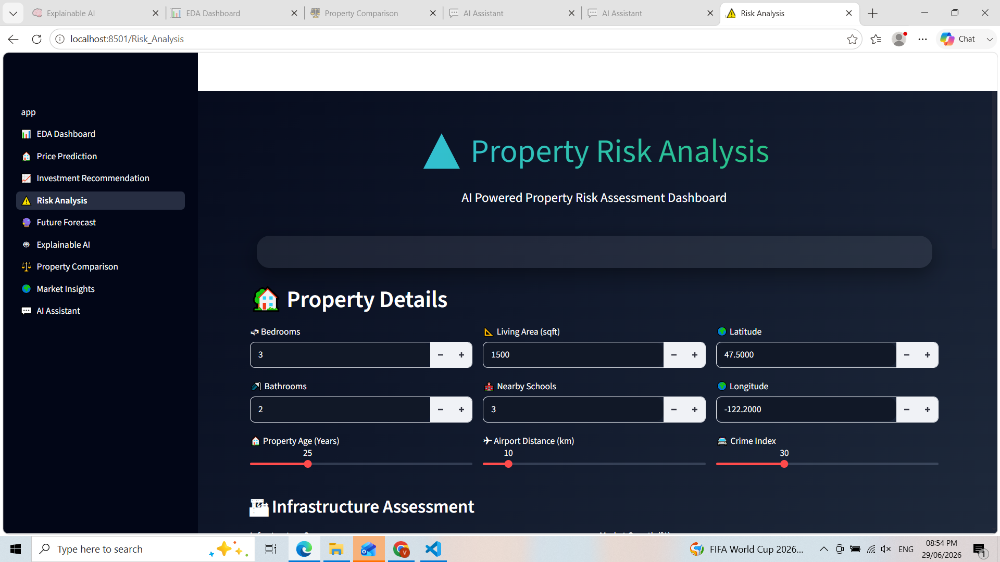
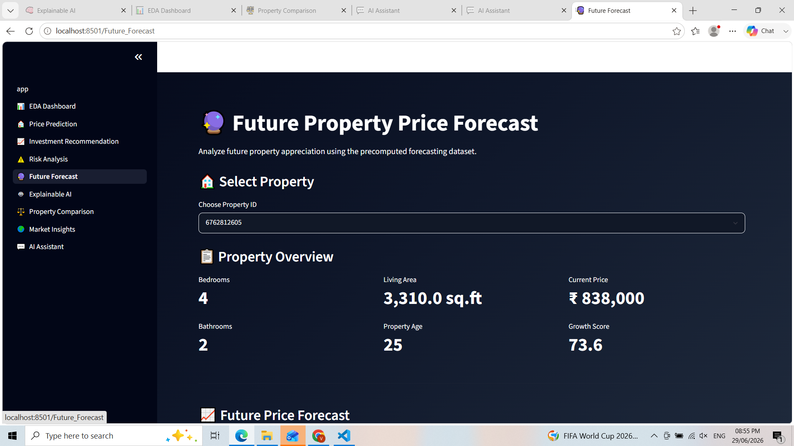
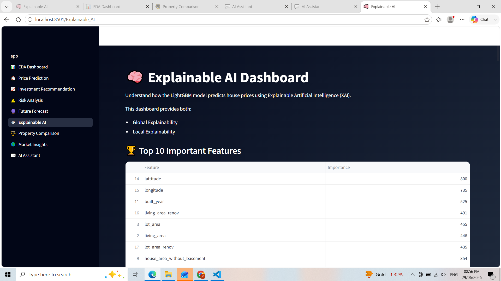
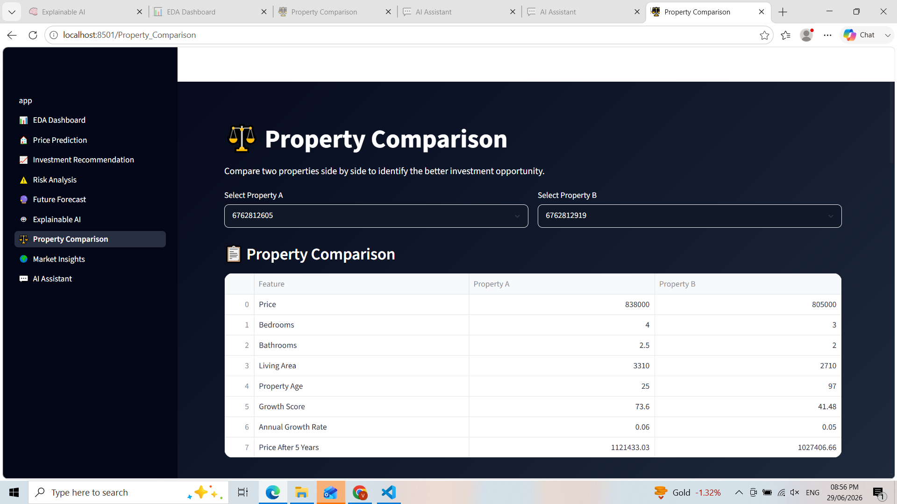
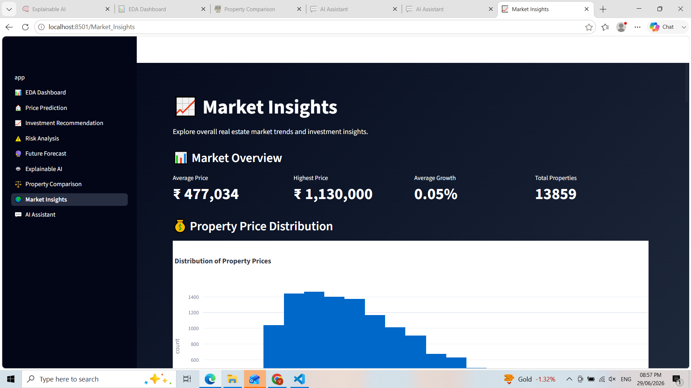
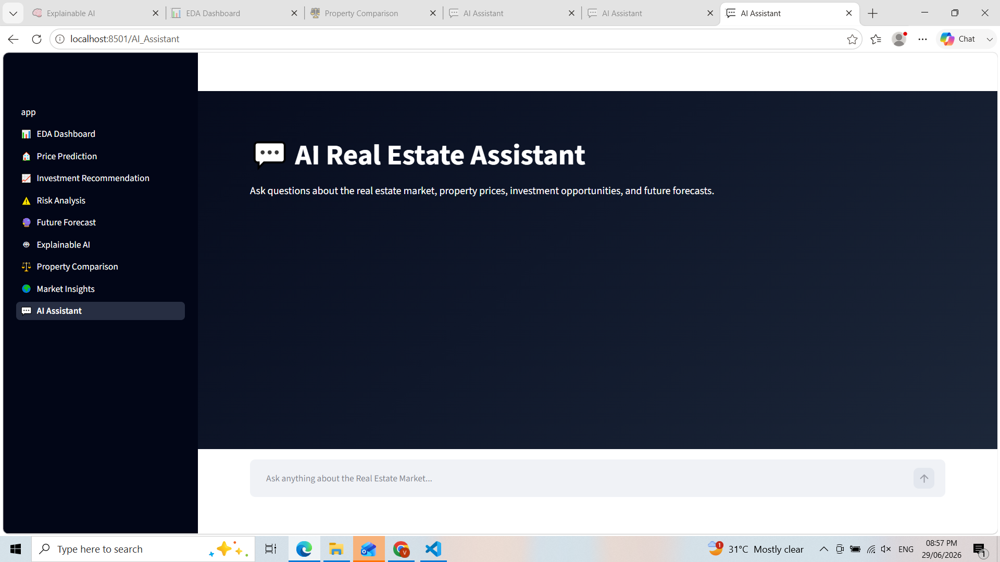

# 🏡 AI-Powered Real Estate Intelligence, Valuation & Investment Recommendation Platform

## 📌 Project Overview

The **AI-Powered Real Estate Intelligence Platform** is an end-to-end Machine Learning application that helps buyers, investors, and real estate professionals make informed property decisions.

The platform analyzes property characteristics, predicts house prices, estimates future appreciation, evaluates investment risk, recommends Buy/Hold/Sell decisions, explains AI predictions using SHAP (Explainable AI), and presents everything through an interactive Streamlit dashboard.

---

## 🚀 Features

- 🏠 House Price Prediction using Machine Learning
- 📊 Exploratory Data Analysis (EDA)
- 💰 Investment Recommendation Engine
- ⚠️ Property Risk Analysis
- 🔮 Future Price Forecast (1, 3 & 5 Years)
- 🧠 Explainable AI using SHAP
- ⚖️ Property Comparison Dashboard
- 📈 Market Insights Dashboard
- 💬 AI Real Estate Assistant
- 📥 Downloadable Reports
- 🎨 Modern Interactive Streamlit Dashboard

---

## 🛠️ Technology Stack

### Programming Language
- Python

### Libraries
- Pandas
- NumPy
- Scikit-Learn
- XGBoost
- CatBoost
- LightGBM
- SHAP
- Plotly
- Matplotlib
- Joblib
- Streamlit

---

## 🤖 Machine Learning Models

The following models were trained and evaluated:

- Linear Regression
- Random Forest Regressor
- Gradient Boosting Regressor
- XGBoost Regressor
- CatBoost Regressor
- LightGBM Regressor (Best Performing Model)

Models were compared using:

- MAE
- MSE
- RMSE
- R² Score

---

## 📂 Project Structure

```text
RealEstate-AI/
│
├── app.py
├── requirements.txt
├── README.md
├── assets/
├── dataset/
│   ├── raw/
│   ├── cleaned/
│   └── processed/
├── models/
├── notebooks/
├── pages/
└── screenshots/
```

---

## 📊 Dashboard Pages

### 🏠 Home
Project overview and navigation.

### 📊 EDA Dashboard
- Histograms
- Correlation Heatmap
- Scatter Plots
- Distribution Analysis

### 💵 Price Prediction
Predict house prices using the trained LightGBM model.

### 💰 Investment Recommendation
Provides Buy, Hold, or Sell recommendations based on predicted ROI and business rules.

### ⚠️ Risk Analysis
Evaluates property investment risk and categorizes it as Low, Medium, or High.

### 🔮 Future Forecast
Forecasts property prices for:
- 1 Year
- 3 Years
- 5 Years

### 🧠 Explainable AI
Displays:
- Feature Importance
- SHAP Global Explainability
- SHAP Local Explainability

### ⚖️ Property Comparison
Compare two properties side by side using important features and predicted prices.

### 📈 Market Insights
Visualizes:
- High Growth Areas
- Low Risk Areas
- Best Investment Locations

### 💬 AI Assistant
Interactive chatbot for answering real estate-related questions using project data.

---

## 📊 Dataset

The project uses a real estate housing dataset containing property details such as:

- Bedrooms
- Bathrooms
- Living Area
- Lot Area
- Property Age
- House Grade
- Basement Area
- Location Coordinates
- School Availability
- Airport Distance
- Sale Price

Additional features were engineered for forecasting and investment analysis.

---

## 🧠 Explainable AI

The project incorporates Explainable AI (XAI) using SHAP to improve model transparency.

Features include:

- Global Feature Importance
- SHAP Summary Plot
- Local SHAP Explanation
- Positive & Negative Feature Contributions

---

## ⚙️ Installation

Clone the repository:

```bash
git clone https://github.com/YOUR_USERNAME/RealEstate-AI.git
```

Move into the project directory:

```bash
cd RealEstate-AI
```

Install dependencies:

```bash
pip install -r requirements.txt
```

Run the Streamlit application:

```bash
streamlit run app.py
```

---

## 📸 Screenshots

## 📸 Application Screenshots

### 🏠 Home Page


---

### 📊 EDA Dashboard



---

### 💵 Price Prediction



---

### 💰 Investment Recommendation



---

### ⚠️ Risk Analysis



---

### 🔮 Future Forecast



---

### 🧠 Explainable AI



---

### ⚖️ Property Comparison



---

### 📈 Market Insights



---

### 💬 AI Assistant


## 📈 Future Enhancements

- Real-time property price prediction using APIs
- Rental yield estimation
- Interactive map visualization
- User authentication
- Cloud deployment
- Database integration (MongoDB / SQL)
- Generative AI powered recommendation assistant

---

## 👩‍💻 Author

**Likhitha Vasa**

Electronics and Communication Engineering (ECE)

Aspiring AI & Machine Learning Engineer

---

## ⭐ Acknowledgements

This project was developed as part of an academic AI/ML project to demonstrate end-to-end machine learning, explainable AI, forecasting, and dashboard development using Python and Streamlit.